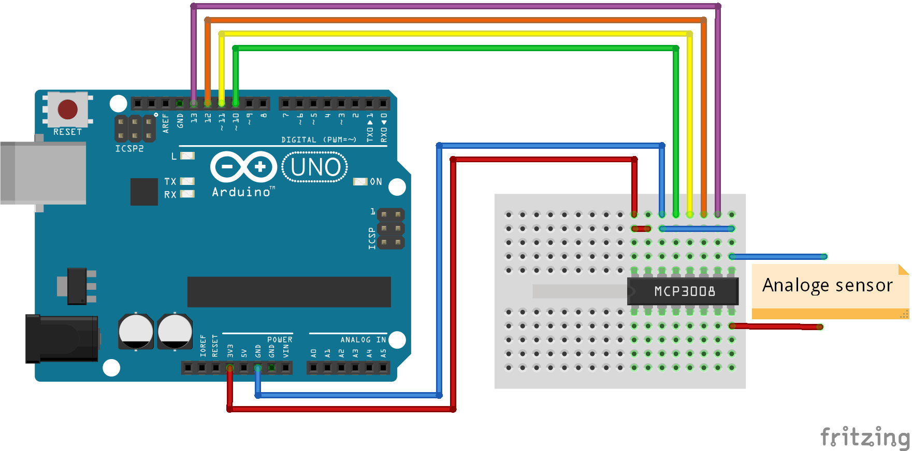
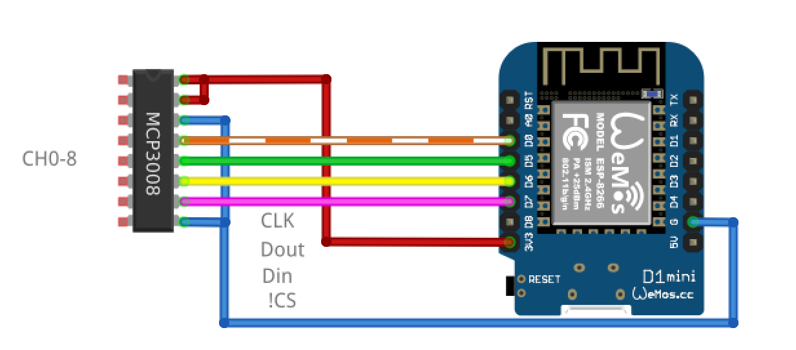

ADC_MCP3008
===========

The MCP3008 is an 8 channel 10bit analog to digital converter. Use it to sample analog signals from eg. flex sensors or LDRs (coupled as voltage dividers)

Why?
====

Measuring analog voltages from sensors is pretty cool.

What?
=====

The code example instantiates a single ADC object, which can then be polled for a voltage from each of its 8 channels.

Use the [Serial Plotter](https://rheingoldheavy.com/new-arduino-serial-plotter/) (CTRL/CMD+SHIFT+L) for a nice visual representation of the analog values. 

How?
=====

Get the MCP3008 library from [here](https://github.com/nodesign/MCP3008/archive/master.zip), and unpack it in your [Arduino libraries folder](https://www.arduino.cc/en/Guide/Libraries#toc5).

Hook up the ADC to an arduino UNO as follows:

Several ADCs can be connected to one arduino, edit the code to instantiate one ADC object per physical device. They can share the datapins, but need seperate CS (chip select) pins.

If you're using the wemos D1mini (ESP8266) board, connect it like this, comment out the pin definitions for the uno, and uncomment the pin definitions for the D1 mini:

Hooking up Sensors?
===================

Most sensors that rely on a change in resistance need to be coupled as voltage dividers to work with an ADC. Have a look at the [FSR readme](../FSR/README.md) for a nice example.

BONUS
=====
[MCP3008 Datasheet](https://stevieb9.github.io/rpi-adc-mcp3008/datasheet/MCP3008.pdf)

[Purchase an MCP3008 from farnell](http://dk.farnell.com/microchip/mcp3008-i-p/10bit-adc-2-7v-8ch-spi-16dip/dp/1627174)