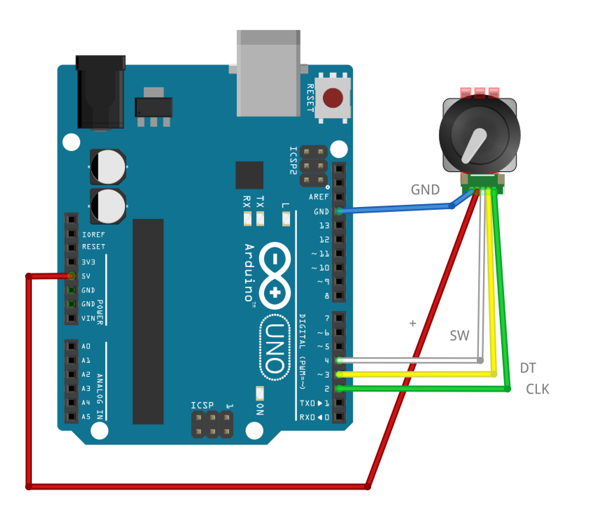

Encoder
=======

Rotary encoder readout based on [Paul Stoffregen's gorgeous encoder library](https://github.com/PaulStoffregen/Encoder)

Specificially tested with the [KY-040 encoder module](http://henrysbench.capnfatz.com/henrys-bench/arduino-sensors-and-input/keyes-ky-040-arduino-rotary-encoder-user-manual/), which also has a (Normally Open) pushbutton at the center shaft.

Why?
====

For measuring the speed or position of spinning things.

What?
=====

The code example instantiates a single encoder object, and reads either speed or position to the serial port. Toggle between speed and position readout by pushing the button.

Use the [Serial Plotter](https://rheingoldheavy.com/new-arduino-serial-plotter/) (CTRL/CMD+SHIFT+L) for a nice visual representation of the encoder values. 

How?
=====

Get the encoder library from [here](https://github.com/PaulStoffregen/Encoder/archive/master.zip), and unpack it in your [Arduino libraries folder](https://www.arduino.cc/en/Guide/Libraries#toc5).

Hook up the encoder as follows:

Use one or more [interrupt pins](https://www.arduino.cc/en/Reference/attachInterrupt) to connect to the CLK/DT (A,B) pins for tighter code execution. (we love you, Paul!)

The SW(itch) pin is only needed if you want to read the state of the pushbutton.

Several encoders can be connected to one arduino, edit the code to instantiate one encoder object per physical device.
