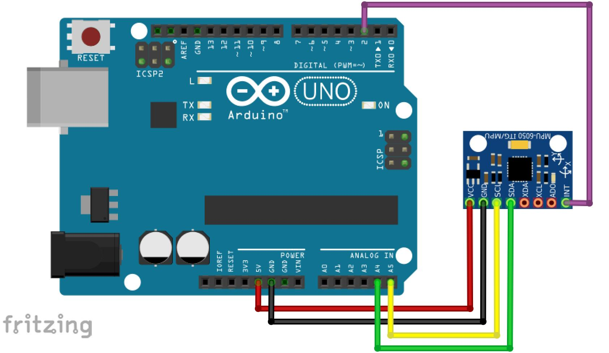

The MPU6050 is a gyroscope/accelerometer Inertial Measurement Unit
==================================================================
It can do a lot of really crazy calculations with positional data, so the code in these examples can get pretty intimidating. We have tried simplifying it by placing all the nasty code somewhere else, and split the usage of the device into two examples that shold cover a pretty wide range of use cases:

1: printout of yaw, pitch, roll. 
--------------------------------
As described here:


You can of course choose to do something else than print it out... maybe even use an if statement?? :)

2: printout of movement in 3 axes 
-------------------------------------
(Up/Down , Left/Right, Forward/Backward )

Motion is determined as a jerk move above a certain threshold. (minimumJerk)

Connecting to the Uno
---------------------




Precision?
----------

Each MPU6050 has it own specific calibration values. The sensor works with a default calibration, but better results are achieved after calibration. 

The calibration sketch has a howto guide in the comments of the sketch, but it will basically output 4 values that can be put into the setOffset parts of the sketches in the first and second examples eg:

```c++
    mpu.setXGyroOffset(-133);
    mpu.setYGyroOffset(132);
    mpu.setZGyroOffset(122);
    mpu.setZAccelOffset(1413); 
```

