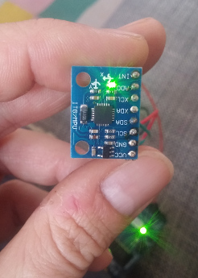

This code looks really intimidating, but focus on the setup() and loop() functions and you should be fine.

The code will detect jerky movements in 3 dimensions and print out a corresponding direction.

A jerk is defined as a sudden movement in any direction. It is determined by the minimumJerk threshold.

The jerk directions are compensated for the orientation of the MPU6050 module. **Meaning that _up will be up_ (and so on) regardless of how the module is oriented**

Sometimes this example will halt **I'm still working on why..** .. the easiest fix is to press the reset button on the arduino, while holding the MPU level in the right orientation as shown here:

