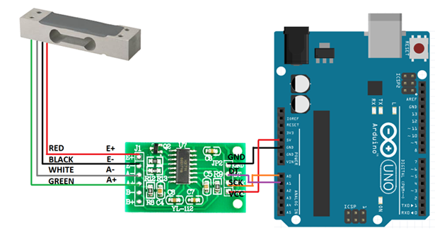

The HX711 amplifier is used to interface load cells
=========================================

Serial data is clocked out of the amplifier using two pins (clock and data).

Getting started
---------------

Download [this library](https://github.com/bogde/HX711/archive/master.zip) and extract it in your [Arduino libraries folder](https://www.arduino.cc/en/Guide/Libraries#toc5).

Hook up the HX711 as shown here:

Mounting
--------

Sparkfun has an excellent tutorial for mounting loadcells [here](https://learn.sparkfun.com/tutorials/load-cell-amplifier-hx711-breakout-hookup-guide)

Calibration
-----------

*Get something with a known weight (10-100grams).

*Upload the loadCellCalibration.ino sketch to your arduino, open the serial monitor and follow the guide.

It calibrates the scale following these points:

1. Call set_scale() with no parameter.
2. Call tare() with no parameter.
3. Place a known weight on the scale and call get_units(10).
4. Divide the result in step 3 to your known weight. You should get about the parameter you need to pass to set_scale.
5. Adjust the parameter in step 4 until you get an accurate reading.

Running
-------

loadCell.ino contains the code needed to measure the weight of an object and print the weight to the serial monitor. Modify the code to your needs.